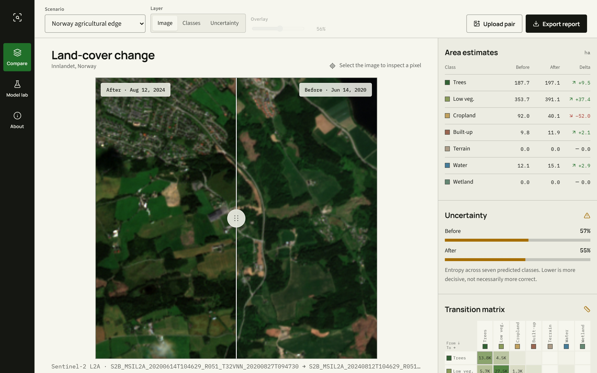
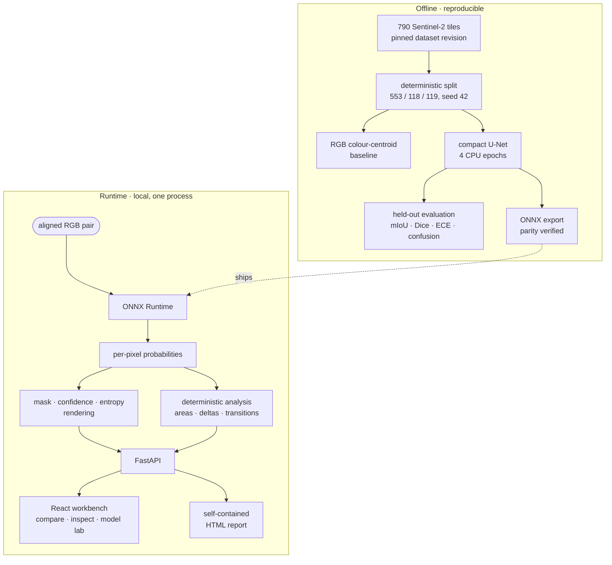
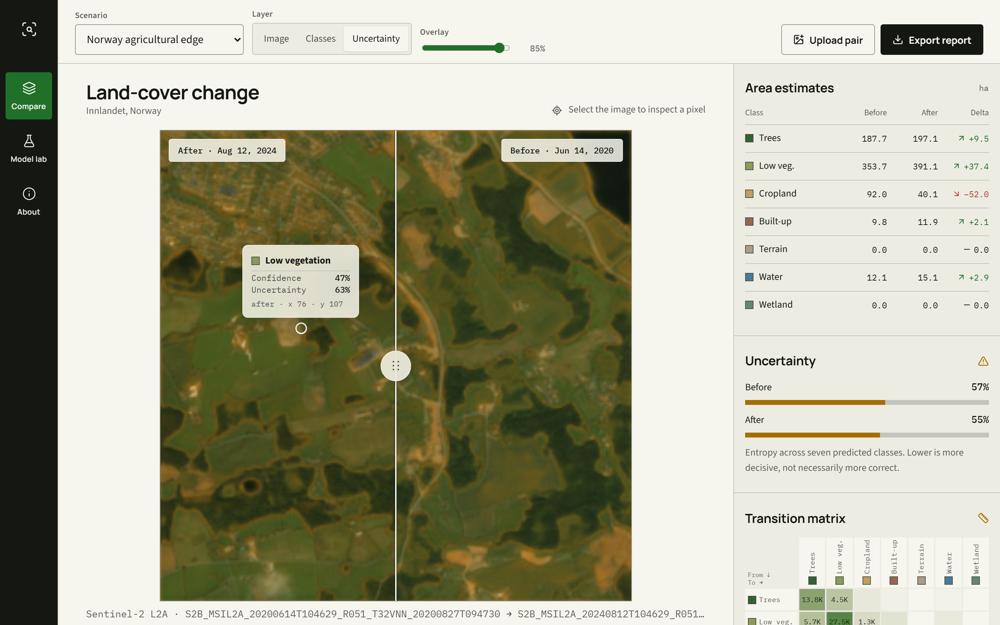
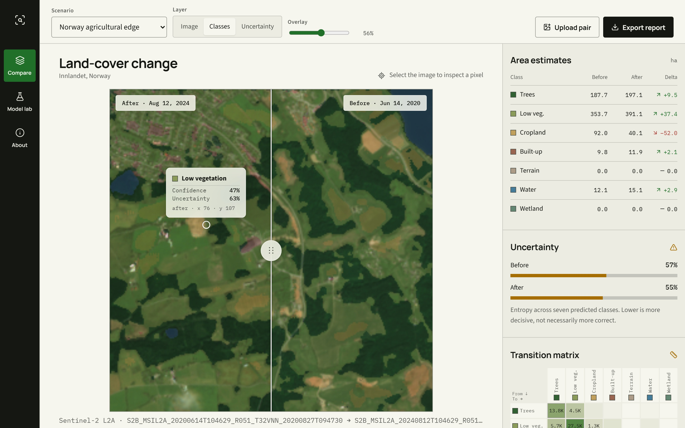
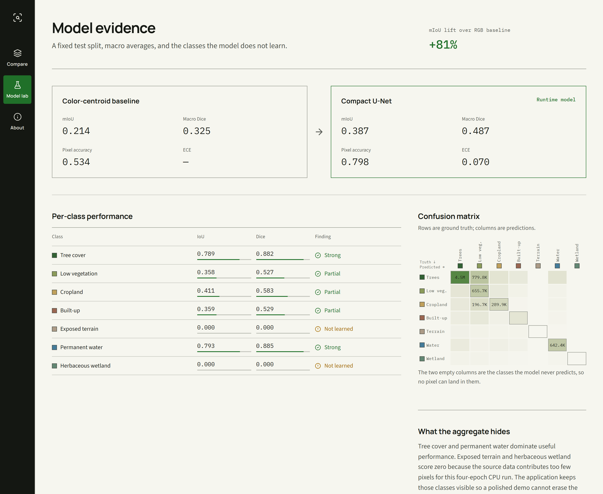
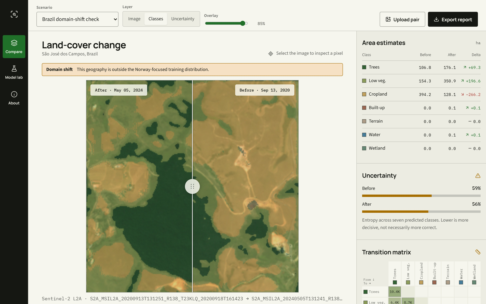
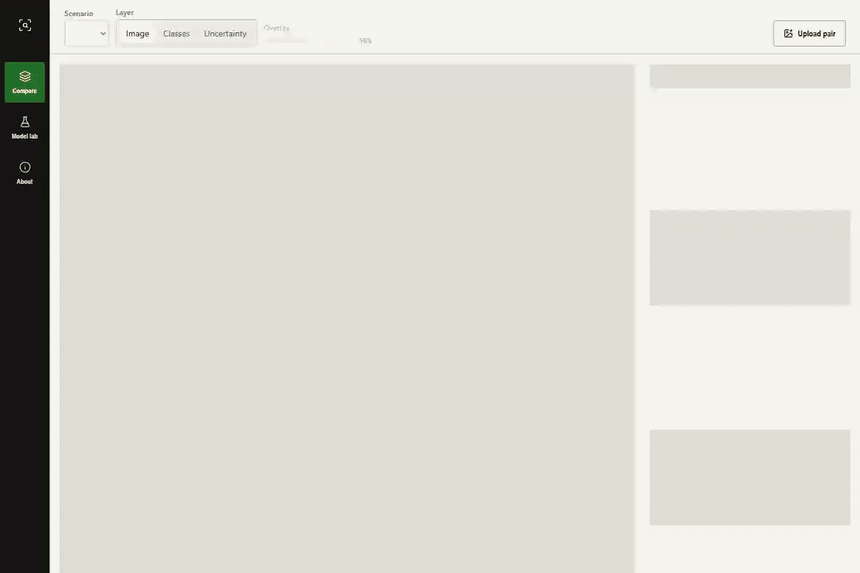
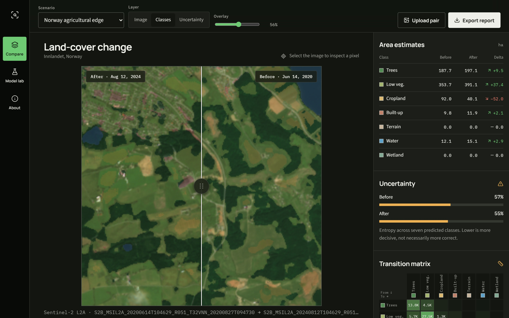
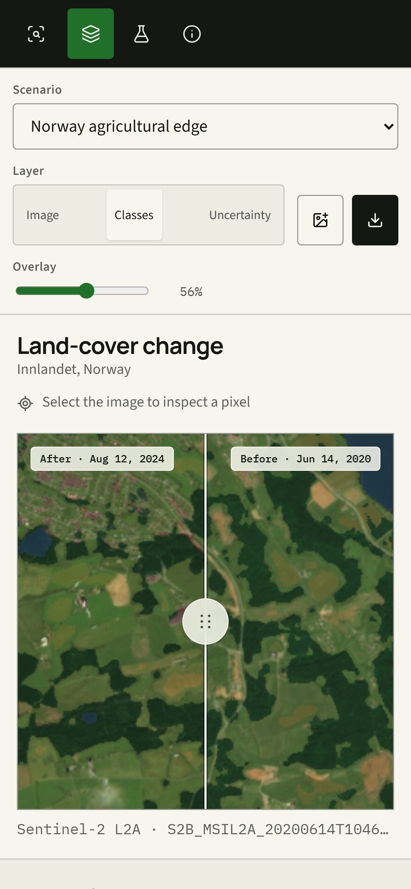

<div align="center">

# RasterScope

**A land-cover change workbench where the network only proposes classes —
and every number after that is arithmetic you can read, test and re-run.**

[](https://github.com/diegormirhan/rasterscope/actions/workflows/ci.yml)
[](.python-version)
[](frontend/)
[](LICENSE)

[](#running-it)
[](#running-it)
[](#running-it)
[](#running-it)

[What it takes seriously](#the-problem-it-takes-seriously) ·
[Architecture](#architecture) ·
[Where the line sits](#where-the-line-sits) ·
[Measurements](#what-is-measured) ·
[The interface](#seeing-it-run) ·
[Run it](#running-it) ·
[Limits](#known-limitations)

</div>

---

Point RasterScope at two aligned satellite images of the same place, years apart. A compact U-Net
labels every pixel with one of seven land-cover classes, and deterministic code turns those labels
into hectares, deltas and a complete before-to-after transition matrix. Drag the divider to compare
the dates, click a pixel to read its class, confidence and entropy, export the whole thing as one
self-contained HTML file.

Everything runs on one machine through ONNX Runtime. No GPU, no API key, no cloud, no Streamlit.



*Innlandet, Norway: 2020 on the right, 2024 on the left, one draggable rule between them. The rail is
the point — area per class, the delta, the mean entropy of each prediction, and the matrix of what
turned into what. Cropland reads `−52.0 ha` and low vegetation `+37.4 ha`, and the matrix says where
those hectares went.*

---

## The problem it takes seriously

A segmentation demo is easy to make convincing and hard to make honest. The model outputs a colour
per pixel, the colours look plausible over satellite imagery, and a screenshot is indistinguishable
from one produced by a model that works. Aggregate metrics hide the same thing: this model's mIoU is
0.387, which sounds like a mediocre-but-working system, and it is really two classes it handles well,
three it handles partially, and **two it never predicts at all**.

RasterScope's premise is that a portfolio system should be built so that it *cannot* hide that.

| Question | Who answers it | Auditable? |
|---|---|---|
| What class is this pixel? | The U-Net | ⚠️ learned |
| How confident, and how spread out, is that prediction? | `softmax`, normalised entropy | ✅ |
| How many hectares of each class? | Pixel count × 10 m × 10 m | ✅ |
| What turned into what? | A 7 × 7 count over two masks | ✅ |
| Is this geography inside the training distribution? | The scenario's own manifest | ✅ |
| Is the exported report the same as the screen? | One render of one payload | ✅ |

The claim is not that the model is good. It is that **exactly one step in this system is uncertain,
and the interface says which one.**

---

## Architecture



Five packages with one rule between them: `ml` owns training and evaluation, `runtime` owns the ONNX
session and rendering, `domain` owns every calculation derived from a mask, `api` owns validation and
routes, `reporting` owns the portable evidence file. `domain` imports no model and no framework,
which is what lets its tests run in milliseconds with no GPU, no network and no ONNX session.

[`docs/architecture.md`](docs/architecture.md) has the full request flows.

---

## Where the line sits

The network produces a probability distribution over seven classes for each of 65,536 pixels.
Everything downstream is ordinary arithmetic:

```
area_hectares(class c) = count(mask == c) × (10 m × 10 m) / 10,000

transition[i][j]       = count(before == i AND after == j)

uncertainty(pixel)     = H(p) / log(7),   H(p) = −Σ pₖ log pₖ
```

Normalising entropy by `log(K)` is what makes the uncertainty layer readable: it puts a maximally
undecided pixel at exactly 1.0 and a certain one at 0.0, independently of how many classes exist. The
layer is labelled *uncertainty*, not *error* — a confidently wrong pixel has low entropy, and saying
otherwise would be the overclaim this project is arguing against.



*The entropy layer, green for decided and amber for undecided. Dense woodland is where the model is
sure of itself; the open agricultural mosaic is where it is not — and that matches the per-class
metrics below, where tree cover scores 0.789 IoU and low vegetation 0.358. The confidences are not
arbitrary, which is the only thing that makes this layer worth rendering.*



*One pixel, four facts: the predicted class, the softmax confidence, the normalised entropy, and the
coordinate the query used. The readout is anchored on the pixel it describes and clamped inside the
frame, so an edge pixel is as inspectable as a central one.*

**Why the two are kept apart.** Swap the model and every learned output changes; the hectare
conversion, the delta and the transition matrix must not. They are pure functions over an integer
array, tested against hand-computed fixtures, and they are the reason a number on this screen can be
checked without running inference at all.

---

## What is measured

All figures below come from the fixed 119-image test split — 7,797,760 labelled pixels — and no test
image took part in model selection. The selection metric was validation mIoU.

| Model | mIoU | Macro Dice | Pixel accuracy | ECE |
|---|---:|---:|---:|---:|
| RGB colour-centroid baseline | 0.214 | 0.325 | 0.534 | — |
| **Compact U-Net, 4 CPU epochs** | **0.387** | **0.487** | **0.798** | **0.070** |

The U-Net improves mIoU by **80.85%** over the baseline. The baseline exists precisely so that number
has a floor to be measured against: a classifier that assigns each pixel to the nearest class colour
centroid is what "no learning at all" scores on this data.

### The aggregate hides two complete failures

| Class | IoU | Dice | Truth pixels | Pixels predicted |
|---|---:|---:|---:|---:|
| Tree cover | 0.789 | 0.882 | 5,567,402 | 4,748,890 |
| Permanent water | 0.793 | 0.885 | 700,212 | 751,845 |
| Cropland | 0.411 | 0.583 | 542,251 | 452,371 |
| Built-up | 0.359 | 0.529 | 177,338 | 143,529 |
| Low vegetation | 0.358 | 0.527 | 785,471 | 1,701,125 |
| **Exposed terrain** | **0.000** | **0.000** | 16,890 | **0** |
| **Herbaceous wetland** | **0.000** | **0.000** | 8,196 | **0** |

Exposed terrain is 0.22% of the test pixels and herbaceous wetland is 0.11%. Weighted cross-entropy
plus a Dice term moved them from "rare" to "still rare", and in four epochs on a CPU the model
settled on never predicting either. Two columns of the confusion matrix are therefore empty, which is
visible on screen rather than buried in a notebook.

The dominant real error is elsewhere and less obvious: **low vegetation is over-predicted 2.2×**,
mostly by absorbing tree cover — 779,766 tree pixels are called low vegetation. A summary that only
reported mIoU would not have told you which direction the model is wrong in.



*The Model Lab is the argument rendered instead of asserted: baseline beside runtime model, IoU and
Dice drawn against a full track so a zero reads as an empty bar rather than a rounding artefact, and
a confusion matrix with both axes labelled — because seven greens against a legend elsewhere on the
page is not a readable matrix.*

### Calibration was the thing that actually improved

| Epoch | Train loss | Validation mIoU | ECE |
|---:|---:|---:|---:|
| 1 | 1.227 | 0.326 | 0.336 |
| 2 | 0.930 | 0.369 | 0.224 |
| 3 | 0.752 | 0.365 | 0.088 |
| 4 | 0.679 | **0.383** | **0.070** |

Between epochs 2 and 3 mIoU went *down* and expected calibration error fell by more than half. If the
run had been selected on accuracy alone, the interesting change would have been invisible: the model
stopped being confidently wrong before it got much more correct. An uncertainty layer is only worth
displaying if the confidences behind it mean something, so this is the number that earns that panel.

### The export is verified, not assumed

Training happens in PyTorch and inference happens in ONNX Runtime, which is two implementations of
the same arithmetic and therefore a place where a portfolio project quietly breaks. Both were run on
a real Sentinel-2 scene and compared:

- maximum absolute logit error: `2.74e-6`
- mean absolute logit error: `1.95e-7`
- predicted-mask agreement: **100%**

---

## Two scenarios, one of them designed to fail

| Scenario | Dates | Role |
|---|---|---|
| Innlandet, Norway | 2020-06-14 → 2024-08-12 | Near the training geography |
| São José dos Campos, Brazil | 2020-09-13 → 2024-05-05 | Deliberate out-of-distribution stress case |

The Brazil scene is not there to show the model working. It is there because the training tiles are
Norway-focused, and the honest thing to do with a model outside its distribution is to run it and say
so on screen.



*Same instrument, different biome. The warning is rendered from the scenario's own `domain_shift`
flag, so it cannot be forgotten in a demo. The numbers beside it are large and confident — cropland
`−266.2 ha`, low vegetation `+196.6 ha` — and that is exactly why the banner is there.*

The two Brazil dates are also different seasons — September against May — which is a second confound
stacked on the first. A model trained on Norwegian summer tiles, run on a Brazilian scene, comparing
two points in an agricultural cycle: three good reasons not to read those hectares as land-use change.

Neither scene has ground-truth masks. Their changes are model predictions, not measured environmental
outcomes; the [data card](docs/data-card.md) states this at length, along with provenance and the
label mapping.

---

## Seeing it run

Three surfaces: **Compare**, **Model lab**, **About**. Compare pairs the imagery with a continuous
analysis rail rather than a stack of cards, on the principle that the image is the working material
and the chrome exists to explain it.

<div align="center">



</div>

*Twenty seconds, unnarrated: compare the dates, switch to predicted classes, fade the overlay,
inspect a pixel, switch to uncertainty, cross into the out-of-distribution scene, end on the two
classes the model never learned. Generated by `scripts/capture_media.py`, not recorded by hand — a
`--seconds 30` cut of the same run walks the same path slowly enough to read, and both are also
written as MP4 in [`docs/media/`](docs/media/).*

The interaction work follows Apple's *Designing Fluid Interfaces* rather than a generic dashboard
idiom, and three decisions came out of it:

**The divider is not a React-rendered value.** A pointer move writes the position straight to a CSS
custom property on the frame, so the reveal tracks the finger within the same frame as the input
instead of waiting for a render pass. React state follows for the accessible value and for deciding
which date a click lands on.

**It respects where you grabbed it.** Pressing the handle 8 px off-centre keeps that 8 px offset for
the whole drag. Re-centring the control under the pointer is the single detail that makes a drag feel
like a widget rather than an object.

**A double-click re-centres it with a spring, and the spring is interruptible.** It is a real
critically-damped integration in [`spring.ts`](frontend/src/lib/spring.ts), not a CSS transition,
because a transition cannot be grabbed mid-flight — `stop()` hands back the live value and velocity,
so pressing the handle during the return picks it up exactly where it is rather than snapping.

Everything else is deliberately quiet: 90–220 ms, opacity and transform only, feedback on
pointer-down rather than on release, and no motion at all under `prefers-reduced-motion`.

| | |
|---|---|
|  |  |

*Left: the same workbench in the dark scheme — every surface token is defined in both, and the nav
rail and the divider are the two things that stay fixed, because one is chrome and the other
separates two photographs. Right: a 390 px phone, where the layer switch, the overlay slider and the
report export all remain reachable. A control that only exists on a desktop is a control the product
does not really have.*

Reduced transparency and increased contrast are handled where they belong — the frosted surfaces
resolve to solid ones at the token layer, so no component needs to know about it.

---

## Running it

Needs Python 3.12, [uv](https://docs.astral.sh/uv/) and Node 22+. The trained ONNX model and both
prepared scenarios are committed, so the application is demo-ready without retraining anything.

```powershell
git clone https://github.com/diegormirhan/rasterscope.git
cd rasterscope
.\scripts\setup.ps1
.\scripts\run.ps1
```

Or the same steps by hand:

```bash
uv sync --extra dev --extra ml
npm --prefix frontend ci
npm --prefix frontend run build
uv run fastapi run --host 127.0.0.1 --port 8000
```

Then open <http://127.0.0.1:8000>, or <http://127.0.0.1:8000/docs> for the API. For hot reload, run
`npm --prefix frontend run dev` and `uv run fastapi dev` side by side; Vite proxies `/api` and
`/scenarios` to port 8000.

```bash
docker compose up --build
```

The image builds the React application in a Node stage and ships only the Python runtime
dependencies, on one port, with a health check. It binds to `$PORT` when a platform assigns one and
to 8000 otherwise, so the same image runs locally and hosted.

### Deploying it

[`render.yaml`](render.yaml) is a Render Blueprint for that same image. On
[dashboard.render.com](https://dashboard.render.com), choose **New → Blueprint**, point it at this
repository, and apply — there is nothing to configure by hand. Render injects `PORT`, polls
`/api/health`, and redeploys on every push to the tracked branch.

The whole image is about 8 MB of committed evidence on top of the Python runtime, because the model
is 3.8 MB of ONNX and both scenarios are precomputed. Two things to know before sharing the link:

- **The free instance sleeps after 15 minutes idle**, and the next request waits roughly a minute
  for the container to come back. For a portfolio link that a recruiter opens once, that is the
  trade; a paid instance removes it.
- **`POST /api/analyze` writes to the container's disk.** That is fine on an ephemeral filesystem
  and fine behind localhost, but on a public URL it is an unauthenticated write with no quota. If
  the link is going somewhere public and stays up, put the upload route behind a limit first.

**Vercel is the wrong shape for this one.** Its Python runtime is serverless and read-only outside
`/tmp`, which breaks the upload route outright, and every cold start would have to load ONNX Runtime
and the model inside the function. Render runs the container that already exists.

### Reproducing the pipeline

The raw dataset is deliberately not in Git. Pull the exact pinned revision:

```bash
hf download nikolkoo/SatelliteSegmentation \
  --repo-type dataset \
  --revision 6109f61547ea2a3cdb5130983837790628a23821 \
  --local-dir data/raw
```

```bash
uv run rasterscope prepare          # audit and split, deterministically
uv run rasterscope train-baseline   # the floor the U-Net has to beat
uv run rasterscope train --model unet
uv run rasterscope evaluate --model unet
uv run rasterscope export-onnx --model unet
uv run rasterscope build-scenarios  # fetch and precompute the demo scenes
```

`config.yaml` is the single source of truth: paths, label remapping, class names and colours, split
fractions, seed, hyperparameters, inference settings, upload limits and scenario search windows. The
dataset revision and the seed are written into the run artifacts, so a metric always carries the data
it was measured on.

A SegFormer transfer-learning path exists behind `--model segformer`. It is **not** a trained
benchmark here and is deliberately absent from every result table; the published comparison is the
measured baseline against the measured U-Net.

---

## The API

FastAPI serves the built frontend and the API from the same process, with interactive docs at
`/docs`.

| Method | Endpoint | Purpose |
|---|---|---|
| `GET` | `/api/health` | Runtime, model and scenario readiness |
| `GET` | `/api/scenarios` | Auditable scenario catalog |
| `GET` | `/api/scenarios/{id}` | Scenario detail and its analysis |
| `GET` | `/api/scenarios/{id}/inspect` | Class, confidence and uncertainty at one pixel |
| `GET` | `/api/scenarios/{id}/report` | Self-contained HTML evidence report |
| `GET` | `/api/models` | Baseline and U-Net evidence |
| `POST` | `/api/analyze` | Analyze an aligned local image pair |

Uploads take PNG or JPEG up to 12 MB each, are resized to 256 × 256, are processed locally and are
written under the ignored `artifacts/scenarios/uploads/`. Uploaded imagery never leaves the machine.

---

## Verifying it

```bash
uv run pytest --cov              # 16 tests, no GPU and no network
uv run ruff check . && uv run ruff format --check .
npm --prefix frontend test -- --run   # 5 tests
npm --prefix frontend run build
```

The Python tests cover the part of the system that is supposed to be certain: the taxonomy and label
remapping, the deterministic split, IoU / Dice / accuracy / ECE, the area and transition arithmetic,
the U-Net's tensor shapes, and every API route including the failure paths. `domain/analysis.py` and
`api/routes.py` sit at 90% and 89%.

The training loop, the STAC acquisition and the CLI are **not** covered, and that is stated rather
than averaged away: they need the dataset, a network and minutes of compute, so they are exercised by
running them, not by a unit test pretending to.

The interface tests cover what changed most recently — that the divider is drivable and clamped from
the keyboard, that a domain-shift scene announces itself, and that both matrix axes are labelled and
every cell has an accessible name.

Screenshots and the demo recording are regenerated, never retouched:

```bash
uv run --extra media python scripts/capture_media.py
```

A screenshot nobody can regenerate starts lying quietly after the next UI change.

CI also builds the runtime image and serves it on an assigned port. Building the frontend from the
repository root and building it from a copied subtree are not the same test, and only the second one
is what deploys.

---

## Known limitations

Stated because they are real, not because they are theoretical:

- **Two of seven classes are never predicted.** Exposed terrain and herbaceous wetland are 0.22% and
  0.11% of the test pixels and score 0.000 IoU. Every macro average in this README carries two zeros
  inside it.
- **Low vegetation is over-predicted 2.2×**, largely by absorbing tree cover. mIoU alone does not say
  this; the confusion matrix does, which is why it is on screen.
- **The model sees three visible bands.** No red edge, no NIR, no SWIR, no seasonal context — the
  features that make land-cover classification tractable in practice are all absent.
- **Training geography is Norway-focused, so performance elsewhere is unknown**, not merely lower.
  The Brazil scenario demonstrates the behaviour; it does not measure it, because there is no ground
  truth for it.
- **A change between two dates is a change between two independent predictions.** Classification
  error on either date propagates into the delta and the transition matrix, and nothing here
  separates a real transition from two disagreeing guesses.
- **A predicted transition does not establish its cause**, and no view in this application implies
  one.
- **Four CPU epochs is the experiment, not the ceiling.** The numbers describe this run: 16 base
  channels, batch size 8, seed 42. They are not a claim about what a U-Net can do on this task.
- **Area figures assume aligned imagery and 10 m square pixels.** That holds for the prepared
  scenarios; uploaded pairs are reported in pixel counts instead, because RasterScope cannot know
  their resolution or whether they are registered to each other at all.
- **Resizing an arbitrary upload to 256 × 256 distorts small objects**, and a non-satellite image
  will still produce seven confident-looking classes.
- **Outputs are screening evidence.** Not cadastral, not ecological certification, not legal, not
  emergency response. Read the [model card](docs/model-card.md) before reusing the model.

---

## Repository map

```text
rasterscope/
├── artifacts/            # versioned model and run evidence, prepared demo scenes
├── docs/                 # architecture, data card, model card, screenshots, demo media
├── frontend/             # React 19 · TypeScript · Vite
│   └── src/lib/spring.ts # the interruptible spring behind the divider
├── scripts/              # Windows setup/run helpers and media capture
├── src/rasterscope/
│   ├── api/              # HTTP boundary and upload orchestration
│   ├── domain/           # deterministic analysis — no model, no framework
│   ├── ml/               # data, models, training, evaluation, export
│   ├── reporting/        # self-contained HTML evidence
│   └── runtime/          # ONNX inference and raster rendering
├── tests/                # Python unit and API tests
├── config.yaml           # one source of truth for the whole pipeline
├── tokens.css            # design tokens, light and dark
├── render.yaml           # Render Blueprint for the Docker image
└── Dockerfile
```

## Documentation

- [Product definition](PRODUCT.md) · [Design rationale](DESIGN.md)
- [Architecture](docs/architecture.md) · [Data card](docs/data-card.md) · [Model card](docs/model-card.md)

## Stack

`FastAPI 0.141` · `ONNX Runtime 1.29` · `NumPy 2.5` · `Pillow 12` · `Pydantic 2.13` ·
`React 19` · `TypeScript 5.9` · `Vite 7` · `Vitest 3` · `uv` · `PyTorch` (training only)

No Streamlit, no cloud inference, no GPU requirement at runtime.

## License and attribution

Code is MIT ([LICENSE](LICENSE)). Training data is `nikolkoo/SatelliteSegmentation` under CC BY 4.0;
imagery is Copernicus Sentinel data and labels derive from ESA WorldCover. Demonstration scenes are
acquired from the Microsoft Planetary Computer catalog. Derived imagery retains its upstream terms.

Built by [Diego Mirhan](https://diegomirhan.com) · [GitHub](https://github.com/diegormirhan)
