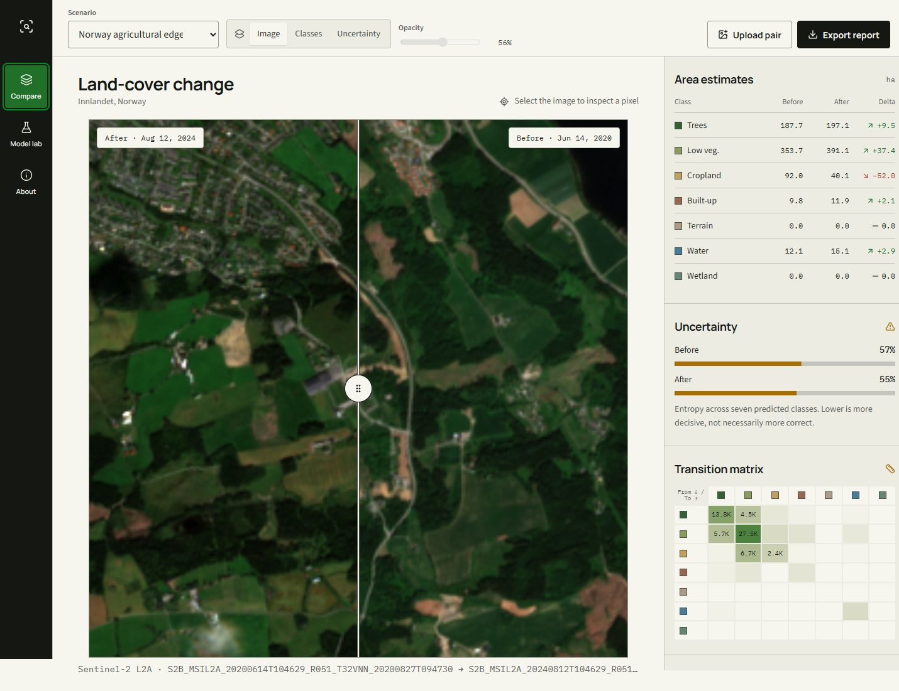
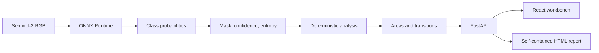

# RasterScope

**Local satellite land-cover segmentation and change analysis, built as an auditable ML product.**

RasterScope compares aligned Sentinel-2 RGB scenes, predicts seven land-cover classes with a compact U-Net, and turns the masks into inspectable area estimates and transition evidence. The model runs locally through ONNX Runtime; deterministic code handles every calculation after inference.



## Why it is portfolio-worthy

This repository covers the full ML lifecycle instead of stopping at a notebook:

- a pinned, audited dataset and deterministic 70/15/15 split;
- a simple color-centroid baseline and a trained segmentation network;
- reproducible evaluation with mIoU, Dice, pixel accuracy, calibration, and confusion matrices;
- PyTorch-to-ONNX export with numerical parity verification;
- a typed FastAPI backend and React/TypeScript interface—no Streamlit;
- before/after comparison, semantic overlays, uncertainty, pixel inspection, and HTML reports;
- tests, CI, Docker packaging, data/model cards, and explicit limitations.

## Measured results

All figures below come from the fixed 119-image test split. No test images were used for model selection.

| Model | mIoU | Macro Dice | Pixel accuracy | ECE |
| --- | ---: | ---: | ---: | ---: |
| RGB color-centroid baseline | 0.214 | 0.325 | 0.534 | — |
| Compact U-Net, 4 CPU epochs | **0.387** | **0.487** | **0.798** | **0.070** |

The U-Net improves mIoU by **80.85%** over the baseline. That aggregate is not the whole story: tree cover (0.789 IoU) and permanent water (0.793) are strong, while exposed terrain and herbaceous wetland score zero because those classes are extremely scarce. RasterScope keeps those failures visible in the Model Lab.


## Product tour

- Drag or keyboard-control the divider to compare dates.
- Switch between RGB, semantic classes, and normalized entropy.
- Click a pixel to inspect class, confidence, and uncertainty.
- Review class areas and a complete before-to-after transition matrix.
- Switch to the Brazil scene to see an explicit domain-shift warning.
- Upload an aligned PNG/JPEG pair for local ONNX inference.
- Export a self-contained HTML evidence report.
- Open Model Lab to inspect held-out metrics and known blind spots.

The interface is responsive and designed as a remote-sensing light table rather than a generic dashboard.

## Architecture



Model inference and domain calculations are deliberately separated. A stochastic prediction can change when the model changes; pixel counts, area conversion, and transition matrices remain independently testable.

See [architecture.md](docs/architecture.md) for component boundaries and request flows.

## Quick start

### Requirements

- Python 3.12
- [uv](https://docs.astral.sh/uv/)
- Node.js 22+

### Windows

```powershell
git clone https://github.com/diegormirhan/rasterscope.git
cd rasterscope
.\scripts\setup.ps1
.\scripts\run.ps1
```

Open [http://127.0.0.1:8000](http://127.0.0.1:8000). The checked-in ONNX model and two prepared scenarios make the application demo-ready without retraining.

### Manual setup

```bash
uv sync --extra dev --extra ml
cd frontend
npm ci
npm run build
cd ..
uv run fastapi run --host 127.0.0.1 --port 8000
```

For frontend hot reload, run `npm run dev` inside `frontend/` and `uv run fastapi dev` in a second terminal. Vite proxies `/api` and `/scenarios` to port 8000.

### Docker

```bash
docker compose up --build
```

The production image builds the React application, installs only Python runtime dependencies, and exposes port 8000.

## Reproduce the ML pipeline

The raw dataset is intentionally excluded from Git. Download the exact pinned revision with the Hugging Face CLI:

```bash
hf download nikolkoo/SatelliteSegmentation \
  --repo-type dataset \
  --revision 6109f61547ea2a3cdb5130983837790628a23821 \
  --local-dir data/raw
```

Then run:

```bash
uv run rasterscope prepare
uv run rasterscope train-baseline
uv run rasterscope train --model unet
uv run rasterscope evaluate --model unet
uv run rasterscope export-onnx --model unet
uv run rasterscope build-scenarios
```

`config.yaml` is the single source of truth for paths, label remapping, classes, splits, training hyperparameters, inference settings, and scenario definitions. Seeds and the dataset revision are persisted with the run artifacts.

A SegFormer transfer-learning implementation is available through `--model segformer`, but it is **not** presented as a trained benchmark in this repository. The published comparison is the measured baseline versus compact U-Net run.

## Data and scenarios

Training uses [`nikolkoo/SatelliteSegmentation`](https://huggingface.co/datasets/nikolkoo/SatelliteSegmentation), pinned to commit `6109f61547ea2a3cdb5130983837790628a23821`. It contains 790 Norway-focused 256 × 256 Sentinel-2 RGB tiles with ESA WorldCover-derived masks at a stated 10 m resolution.

The UI contains two separate temporal demonstrations acquired from the Microsoft Planetary Computer STAC catalog:

| Scenario | Dates | Purpose |
| --- | --- | --- |
| Innlandet, Norway | 2020-06-14 → 2024-08-12 | Near-training-geography comparison |
| São José dos Campos, Brazil | 2020-09-13 → 2024-05-05 | Deliberate out-of-distribution stress case |

These scenes are inference demonstrations, not ground-truth temporal validation. The [data card](docs/data-card.md) documents provenance, label mapping, imbalance, and appropriate use.

## API

FastAPI exposes interactive documentation at `/docs`.

| Method | Endpoint | Purpose |
| --- | --- | --- |
| `GET` | `/api/health` | Runtime, model, and scenario readiness |
| `GET` | `/api/scenarios` | Auditable scenario catalog |
| `GET` | `/api/scenarios/{id}` | Scenario detail and analysis |
| `GET` | `/api/scenarios/{id}/inspect` | Pixel-level class and uncertainty |
| `GET` | `/api/scenarios/{id}/report` | Self-contained HTML report |
| `GET` | `/api/models` | Baseline and U-Net evidence |
| `POST` | `/api/analyze` | Analyze an aligned local image pair |

Uploads accept PNG or JPEG images up to 12 MB each. Images are resized to 256 × 256, processed locally, and stored under the ignored `artifacts/scenarios/uploads/` directory.

## Quality checks

```bash
uv run ruff check .
uv run ruff format --check .
uv run pytest --cov
cd frontend
npm test -- --run
npm run build
```

The trained PyTorch and ONNX models were also compared on a real Sentinel-2 scene: maximum absolute logit error was `2.74e-6`, mean absolute error was `1.95e-7`, and predicted-mask agreement was `100%`.

## Repository map

```text
rasterscope/
├── artifacts/            # versioned model/runtime evidence and demo scenes
├── docs/                 # architecture, data card, model card, visuals
├── frontend/             # React 19 + TypeScript + Vite
├── scripts/              # Windows setup and run helpers
├── src/rasterscope/
│   ├── api/              # HTTP boundary and upload orchestration
│   ├── domain/           # deterministic analysis
│   ├── ml/               # data, models, training, evaluation
│   ├── reporting/        # self-contained HTML reports
│   └── runtime/          # ONNX inference and rendering
├── tests/                # Python unit and API tests
├── config.yaml           # centralized experiment/runtime configuration
└── Dockerfile
```

## Limitations and responsible use

- The model consumes RGB only; multispectral bands and seasonal context are absent.
- Training geography is Norway-focused, so performance elsewhere is unknown.
- Rare classes are not learned reliably in this short CPU experiment.
- Area figures assume aligned imagery and 10 m pixels; uploaded images report pixel counts.
- A predicted transition does not establish its cause.
- Outputs are screening evidence, not cadastral, ecological, legal, or emergency-response conclusions.

Read the full [model card](docs/model-card.md) before reusing the model.

## Documentation

- [Product definition](PRODUCT.md)
- [Design rationale](DESIGN.md)
- [Architecture](docs/architecture.md)
- [Data card](docs/data-card.md)
- [Model card](docs/model-card.md)
- [Portuguese LinkedIn post](LINKEDIN_POST_PT.md)
- [Portuguese demo video script](docs/video-script-pt.md)

## License and attribution

Code is released under the [MIT License](LICENSE). Dataset tiles and derived imagery retain their upstream terms. Training data is distributed under CC BY 4.0 by its dataset author; satellite imagery is Copernicus Sentinel data, and labels derive from ESA WorldCover. Scenario acquisition uses the Microsoft Planetary Computer catalog.

Built by [Diego Mirhan](https://diegomirhan.com) · [GitHub](https://github.com/diegormirhan)
