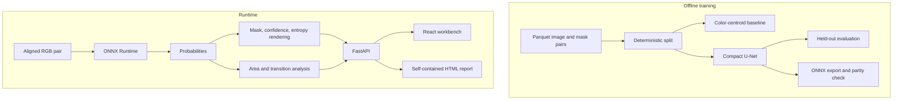

# RasterScope architecture

## Design goals

RasterScope is organized around three constraints: inference must run locally, every post-model calculation must be deterministic, and the interface must expose uncertainty and failure modes instead of hiding them.

## System view

## Boundaries

| Package | Responsibility | Does not own |
| --- | --- | --- |
| `ml` | data loading, taxonomy, models, training, metrics, export | HTTP or UI state |
| `runtime` | ONNX session, preprocessing, probabilities, visual rendering | business interpretation |
| `domain` | areas, deltas, transitions, uncertainty summaries | neural inference |
| `api` | validation, routes, repositories, upload orchestration | model training |
| `reporting` | portable HTML evidence package | browser UI state |
| `frontend` | interaction and visual explanation | metric calculation |

This split makes the central claim auditable: the model predicts a class distribution, while ordinary tested functions derive summaries from that distribution.

## Scenario request flow

1. React requests `/api/scenarios` and receives metadata plus precomputed summaries.
2. Images, masks, and uncertainty rasters are served from `/scenarios/{id}/...`.
3. A pixel click is normalized to 256 × 256 model coordinates.
4. `/api/scenarios/{id}/inspect` reads the saved probability artifact and returns class, confidence, and uncertainty.
5. The report endpoint embeds every image as a data URI, producing one portable HTML file.

## Upload request flow

1. FastAPI accepts two PNG/JPEG files and enforces per-file size limits.
2. Pillow validates and converts both inputs to RGB.
3. The runtime resizes inputs to the configured model size and runs the local ONNX model.
4. Domain functions compute pixel-count areas and the transition matrix.
5. Generated assets are saved under an ignored UUID directory and returned as a normal scenario payload.

Uploaded imagery is never sent to an external model or API.

## Configuration and reproducibility

`config.yaml` centralizes model paths, taxonomy, label remapping, split fractions, seed, optimizer settings, image size, resolution assumption, upload limit, and scenario search windows. The dataset revision and seed are also written into experiment JSON artifacts.

## Deployment

The frontend compiles to static assets served by FastAPI. The default production topology is therefore one process and one port. Docker uses a Node build stage and a minimal Python runtime stage. No database or cloud service is required.
